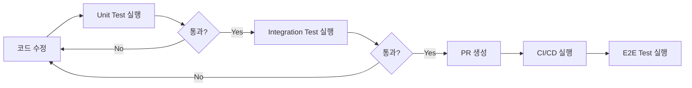

# 🏗️ MCP ↔ Backend 통신 테스트 아키텍처 설계

## 📋 **프로젝트 개요**

Figure-MCP 프로젝트의 MCP 서버와 Backend API 간 HTTP 통신의 안정성과 성능을 검증하기 위한 체계적인 테스트 아키텍처입니다.

## 🎯 **핵심 집중: 템플릿 요청 로직**

**가장 중요한 테스트 포인트**: MCP에서 백엔드로 템플릿을 요청하는 로직
- **워크플로우**: `사용자 요청 → MCP → 백엔드 API → 템플릿 반환 → Copilot/LLM 사용`
- **핵심 API**: `GET /api/templates/guide/{documentType}?site_id={siteId}`
- **응답 형식**: 
  ```typescript
  {
    success: true,
    data: {
      template: "# {{TITLE}}\n내용...",    // LLM이 사용할 템플릿
      variables: ["TITLE", "CONTENT"],     // 치환 가능한 변수들
      instructions: "각 변수를 실제 값으로 치환하세요", // LLM 작업 지침
      usage_count: 42                      // 사용 횟수
    }
  }
  ```

### **템플릿 품질 검증 요소**
1. **마크다운 형식**: 제목, 섹션, 목록 구조 유지
2. **변수 시스템**: `{{VARIABLE_NAME}}` 형태의 치환 가능한 변수
3. **LLM 지침**: 구체적이고 실행 가능한 작업 지시문
4. **응답 일관성**: 동일 요청에 대한 동일 결과

## 🎯 **테스트 전략 (Test Pyramid)**

### **1단계: Unit Tests (단위 테스트)**
**목적**: 각 함수와 모듈의 독립적 동작 검증  
**특징**: 빠른 피드백, 높은 커버리지, 모킹 활용

#### ✅ **장점**
- **빠른 실행**: 수초 내 완료
- **안정적**: 외부 의존성 없음
- **정확한 원인 파악**: 실패 시 정확한 지점 식별
- **개발 중 지속적 피드백**

#### ❌ **단점**
- **실제 통신 검증 불가**: 모킹된 환경에서만 테스트
- **통합 오류 발견 불가**: 컴포넌트 간 상호작용 문제 감지 못함

#### 📝 **구현 예시**
```typescript
// cachedApiCall 메서드 단위 테스트
test('GET 요청이 성공적으로 처리되어야 함', async () => {
  // Arrange
  mockedAxios.get.mockResolvedValue({ data: { success: true } });
  
  // Act
  const result = await testServer.cachedApiCall('GET', '/test');
  
  // Assert
  expect(result.success).toBe(true);
  expect(mockedAxios.get).toHaveBeenCalledTimes(1);
});
```

### **2단계: Integration Tests (통합 테스트)**
**목적**: MCP 서버와 실제 Backend API 간 HTTP 통신 검증  
**특징**: 실제 네트워크 호출, Docker 환경 필요

#### ✅ **장점**
- **실제 통신 검증**: HTTP 프로토콜 레벨에서 검증
- **API 계약 확인**: 백엔드와 프론트엔드 간 인터페이스 검증
- **네트워크 오류 처리**: 실제 네트워크 문제 상황 테스트

#### ❌ **단점**
- **환경 의존성**: Docker 컨테이너 필요
- **느린 실행**: 수십 초~수분 소요
- **불안정성**: 네트워크/서비스 상태에 따라 결과 변동

#### 📝 **구현 예시**
```typescript
// 실제 백엔드와 HTTP 통신 테스트
test('사이트 생성 → 조회 → 수정 → 삭제 전체 플로우', async () => {
  // 실제 API 호출
  const createResponse = await apiClient.post('/sites/', TEST_SITE_DATA);
  expect(createResponse.status).toBe(200);
  
  const listResponse = await apiClient.get('/sites/');
  expect(listResponse.data.success).toBe(true);
});
```

### **3단계: E2E Tests (종단간 테스트)**
**목적**: 실제 사용자 시나리오 전체 플로우 검증  
**특징**: MCP 프로토콜 시뮬레이션, Cursor IDE 연동 모방

#### ✅ **장점**
- **사용자 시나리오 검증**: 실제 사용 패턴 기반 테스트
- **전체 시스템 검증**: 모든 컴포넌트 통합 동작 확인
- **비즈니스 가치 검증**: 실제 기능 동작 확인

#### ❌ **단점**
- **매우 느린 실행**: 수분~수십 분 소요
- **복잡한 디버깅**: 실패 원인 파악 어려움
- **높은 유지보수 비용**: 시스템 변경 시 테스트 수정 필요

#### 📝 **구현 예시**
```typescript
// MCP 클라이언트로 실제 도구 호출
test('영향도 분석서 생성 시나리오', async () => {
  const response = await mcpClient.callTool('create_document', {
    documentRequest: '사용자 인증 시스템 영향도 분석서 만들어줘',
    analysisType: 'full'
  });
  
  expect(response.content[0].text).toContain('영향도 분석서');
  expect(response.content[0].text).toContain('종합 위험도');
});
```

## 🛠️ **구현된 테스트 구조**

```
figure-mcp/tests/
├── setup/                                    # 테스트 설정
│   ├── jest.config.js                       # Jest 설정
│   └── jest.setup.ts                        # 글로벌 설정 및 모킹
├── unit/                                     # 단위 테스트
│   ├── cached-api-call.test.ts              # 일반 API 호출 로직 테스트
│   └── template-request-core.test.ts        # 🎯 템플릿 요청 핵심 로직 (최우선)
├── integration/                              # 통합 테스트
│   ├── mcp-backend-communication.test.ts    # 일반 MCP-백엔드 통신
│   └── template-request-integration.test.ts # 🎯 템플릿 요청 실제 HTTP 통신
├── e2e/                                     # E2E 테스트
│   └── mcp-cursor-integration.test.ts       # MCP 프로토콜 전체 플로우
├── scripts/                                 # 테스트 실행 스크립트
│   ├── test-runner.sh                       # 전체 테스트 실행
│   └── template-request-test-runner.sh      # 🎯 템플릿 요청 집중 테스트
└── test-architecture-plan.md               # 테스트 계획 문서
```

## 📊 **테스트 성능 기준**

### **응답 시간 목표**
- **Unit Tests**: < 10초
- **Integration Tests**: < 2분
- **E2E Tests**: < 5분
- **전체 테스트 스위트**: < 10분

### **커버리지 목표**
- **Unit Tests**: 85% 이상
- **Integration Tests**: 주요 API 엔드포인트 100%
- **E2E Tests**: 핵심 사용자 시나리오 100%

### **안정성 목표**
- **테스트 성공률**: > 95%
- **CI/CD 통과율**: > 98%
- **플레이키 테스트**: < 5%

## 🚀 **실행 방법**

### **개발 환경에서 실행**
```bash
# 🎯 템플릿 요청 집중 테스트 (가장 중요!)
npm run test:template

# 템플릿 요청 핵심 로직만 (빠른 테스트)
npm run test:template:core

# 모든 테스트 실행 (권장)
npm run test

# 개별 테스트 레벨 실행
npm run test:unit          # 단위 테스트만
npm run test:integration   # 통합 테스트만
npm run test:e2e          # E2E 테스트만

# 개발 모드 (자동 재실행)
npm run test:unit:watch

# 커버리지 포함
npm run test:unit:coverage
```

### **Docker 환경 준비 (Integration/E2E 테스트용)**
```bash
# 백엔드 서비스 시작
docker-compose up figure-backend chroma redis

# 백엔드 상태 확인
curl http://localhost:8001/health
```

### **CI/CD 환경**
```bash
# GitHub Actions에서 자동 실행
git push origin main

# 수동 CI 스크립트 실행
npm run test:ci
```

## 🔧 **권장 개발 워크플로우**

### **1. TDD (Test-Driven Development) 적용**
1. **Red**: 실패하는 테스트 작성
2. **Green**: 테스트를 통과하는 최소 코드 작성
3. **Refactor**: 코드 개선 및 최적화

### **2. 테스트 피드백 루프**


### **3. 테스트 우선순위**
1. **매 커밋**: Unit Tests 실행
2. **PR 생성**: 전체 테스트 스위트 실행
3. **메인 브랜치**: 성능 벤치마크 추가 실행

## 🎯 **테스트 시나리오 예시**

### **핵심 비즈니스 시나리오**
1. **문서 생성 플로우**
   ```
   사용자 요청 → MCP 도구 호출 → 백엔드 API → 템플릿 조회 → 문서 생성 → 응답 반환
   ```

2. **JIRA 연동 플로우**
   ```
   JIRA 티켓 키 입력 → MCP JIRA 클라이언트 → JIRA API 호출 → 데이터 파싱 → 요구사항 추출
   ```

3. **캐싱 동작 검증**
   ```
   첫 번째 API 호출 → 백엔드 요청 → 캐시 저장 → 두 번째 호출 → 캐시 반환 (백엔드 호출 없음)
   ```

### **에러 시나리오**
1. **네트워크 오류 처리**
   - Connection Refused
   - Timeout
   - DNS 해결 실패

2. **HTTP 에러 응답**
   - 404 Not Found
   - 500 Internal Server Error
   - 403 Forbidden

3. **잘못된 데이터 처리**
   - 잘못된 JSON 응답
   - 필수 필드 누락
   - 타입 불일치

## 📈 **모니터링 및 리포팅**

### **GitHub Actions 통합**
- **자동 실행**: PR 생성/업데이트 시
- **결과 리포팅**: PR 댓글로 결과 요약
- **아티팩트 저장**: 테스트 로그, 커버리지 리포트

### **커버리지 추적**
- **Codecov 연동**: 커버리지 변화 추적
- **PR 리뷰**: 커버리지 감소 시 알림
- **브랜치별 비교**: 메인 브랜치 대비 변화량

### **성능 모니터링**
- **응답 시간 추적**: API 호출별 성능 측정
- **메모리 사용량**: 테스트 실행 중 리소스 사용량
- **플레이키 테스트 감지**: 간헐적 실패 패턴 분석

## ✅ **성공 기준 및 검증 방법**

### **기능적 성공 기준**
- [ ] 모든 MCP 도구가 정상 동작
- [ ] 백엔드 API와 안정적 통신
- [ ] 에러 상황에서 적절한 처리
- [ ] 캐싱 시스템 정상 동작
- [ ] JIRA 연동 기능 동작 (설정 시)

### **비기능적 성공 기준**
- [ ] 평균 API 응답 시간 < 500ms
- [ ] 캐시 히트율 > 70%
- [ ] 테스트 성공률 > 95%
- [ ] CI/CD 실행 시간 < 10분

### **품질 보증**
- [ ] 코드 커버리지 85% 이상
- [ ] 린터 규칙 100% 준수
- [ ] TypeScript 컴파일 에러 0개
- [ ] 보안 취약점 0개

## 🔄 **지속적 개선 계획**

### **Phase 1: 기본 테스트 구축** (완료)
- [x] 단위 테스트 프레임워크 구축
- [x] 통합 테스트 환경 구성
- [x] E2E 테스트 시나리오 작성
- [x] CI/CD 파이프라인 구축

### **Phase 2: 고도화 및 최적화** (예정)
- [ ] Visual Regression Testing 추가
- [ ] 성능 벤치마크 자동화
- [ ] Chaos Engineering 도입
- [ ] 실제 사용자 데이터 기반 테스트

### **Phase 3: 모니터링 및 분석** (예정)
- [ ] 실시간 모니터링 대시보드
- [ ] 테스트 결과 분석 자동화
- [ ] 예측적 품질 관리
- [ ] A/B 테스트 프레임워크

---

## 🤝 **기여 가이드**

### **새로운 테스트 추가 시**
1. 적절한 테스트 레벨 선택 (Unit/Integration/E2E)
2. 기존 패턴 따라 작성
3. 의미 있는 테스트 이름 사용
4. 충분한 어설션(assertion) 포함
5. 정리(cleanup) 로직 구현

### **테스트 실패 시 대응**
1. 로컬에서 재현 시도
2. 로그 파일 분석
3. 환경 설정 확인
4. 필요시 테스트 격리
5. 원인 파악 후 수정

**🎯 이 테스트 아키텍처를 통해 MCP ↔ Backend 통신의 안정성과 신뢰성을 보장하고, 지속적인 품질 개선을 달성할 수 있습니다.**
