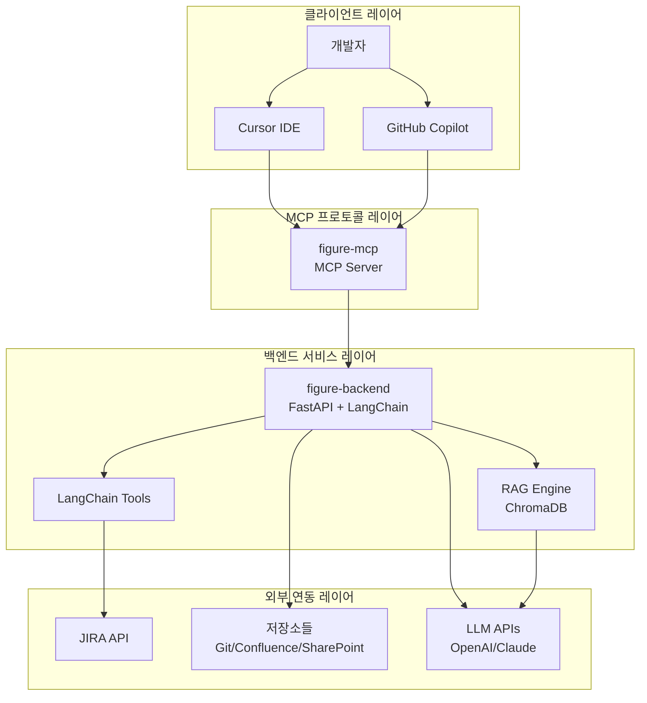
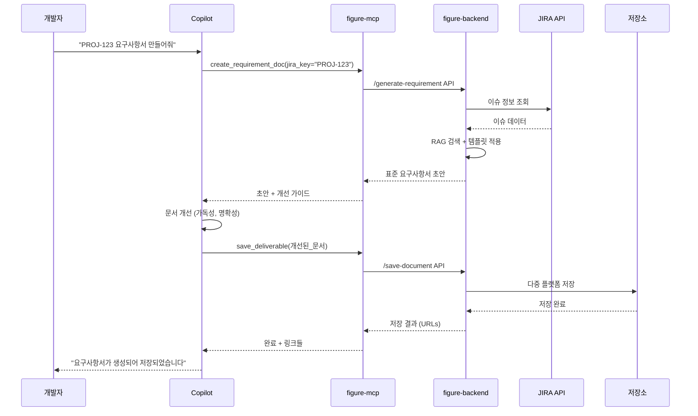
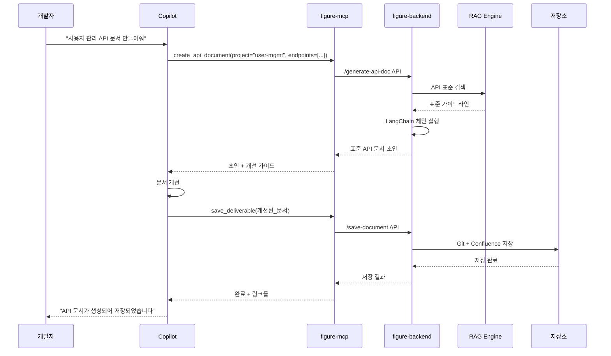

# Figure-MCP 시스템 아키텍처

## 개요

Figure-MCP는 MCP(Model Context Protocol) 기반의 지능형 개발 표준 자동 산출물 생성 시스템입니다. 개발자가 Cursor/Copilot 등의 생성형 AI를 통해 표준화된 개발 문서와 산출물을 자동으로 생성하고 관리할 수 있는 통합 플랫폼을 제공합니다.

## 핵심 기능

### 1. 자동 산출물 생성
- **요구사항 정의서**: JIRA 기반 자동 생성
- **API 문서**: 개발표준 준수 문서 생성
- **배포 가이드**: 환경별 배포 절차서
- **시스템 아키텍처**: 구조도 및 설명서

### 2. 지능형 워크플로우
- **초안 생성**: 표준 완벽 준수 (90% 완성도)
- **AI 개선**: 사용성과 명확성 향상 (10% 완성도)
- **자동 저장**: 다중 플랫폼 동시 저장
- **품질 검증**: 실시간 표준 준수 확인

### 3. 통합 연동
- **개발 도구**: Cursor, GitHub Copilot
- **프로젝트 관리**: JIRA, Confluence
- **저장소**: Git, SharePoint, Notion
- **Vector DB**: ChromaDB 기반 RAG 검색

## 시스템 아키텍처

```
사용자 → 생성형 AI → figure-mcp → figure-backend → 
RAG 엔진 → Vector DB + JIRA API → 구조화된 가이드 반환
```

### 아키텍처 다이어그램



## 컴포넌트 상세 설계

### 1. figure-mcp (MCP 서버)

**역할**: 생성형 AI와 백엔드 서비스 간의 브리지
**기술스택**: TypeScript, MCP SDK
**주요 도구**:

```typescript
// MCP 도구 목록
{
  "create_requirement_doc": "JIRA 기반 요구사항 정의서 생성",
  "create_api_document": "API 설계서 및 문서 생성", 
  "create_deployment_guide": "배포 가이드 생성",
  "create_architecture_doc": "시스템 아키텍처 문서 생성",
  "save_deliverable": "생성된 산출물 자동 저장",
  "search_standards": "개발표준 검색",
  "validate_document": "문서 표준 준수 검증"
}
```

### 2. figure-backend (백엔드 서비스)

**역할**: 핵심 비즈니스 로직 및 RAG 시스템
**기술스택**: FastAPI, LangChain, ChromaDB, SQLAlchemy
**아키텍처**:

```python
figure-backend/
├── app/
│   ├── api/              # REST API 엔드포인트
│   │   ├── documents.py  # 문서 생성 API
│   │   ├── storage.py    # 저장 관리 API
│   │   └── rag.py        # RAG 검색 API
│   ├── services/         # 비즈니스 로직
│   │   ├── document_generator.py
│   │   ├── rag_service.py
│   │   └── storage_service.py
│   ├── models/           # 데이터 모델
│   ├── chains/           # LangChain 체인들
│   │   ├── requirement_chain.py
│   │   ├── api_doc_chain.py
│   │   └── deployment_chain.py
│   └── adapters/         # 외부 연동
│       ├── jira_adapter.py
│       ├── confluence_adapter.py
│       └── git_adapter.py
```

### 3. RAG 엔진

**역할**: 표준 문서 검색 및 컨텍스트 제공
**기술스택**: ChromaDB, OpenAI Embeddings, LangChain

```python
# RAG 파이프라인
class RAGService:
    def __init__(self):
        self.vectorstore = ChromaDB()
        self.embeddings = OpenAIEmbeddings()
        self.retriever = MultiQueryRetriever()
    
    async def search_standards(self, query: str, site: str):
        # 1. 쿼리 임베딩
        # 2. 사이트별 필터링 검색
        # 3. 컨텍스트 재순위화
        # 4. 구조화된 가이드 반환
```

### 4. LangChain 도구 시스템

**JIRA 도구**:
```python
class JIRASearchTool(BaseTool):
    name = "jira_search"
    description = "JIRA 이슈 검색 및 정보 추출"
    
    def _run(self, project_key: str, issue_type: str):
        # JIRA API 호출하여 이슈 정보 수집
        # 요구사항 추출 및 구조화
```

**Vector 검색 도구**:
```python
class VectorSearchTool(BaseTool):
    name = "vector_search"
    description = "개발표준 문서 검색"
    
    def _run(self, query: str, document_type: str):
        # ChromaDB에서 관련 표준 검색
        # 컨텍스트 기반 가이드 생성
```

**템플릿 도구**:
```python
class TemplateTool(BaseTool):
    name = "template_generator"
    description = "문서 템플릿 생성"
    
    def _run(self, doc_type: str, metadata: dict):
        # 표준 템플릿 로드
        # 메타데이터 기반 커스터마이징
```

## 워크플로우 설계

### 1. 요구사항 정의서 생성



### 2. API 문서 생성



## 저장소 연동 전략

### 1. 다중 플랫폼 저장

```python
# 저장소별 설정
STORAGE_CONFIG = {
    "requirement_doc": {
        "confluence": True,    # 팀 위키
        "sharepoint": True,    # 조직 문서관리
        "git": False          # 코드와 분리
    },
    "api_documentation": {
        "confluence": True,    # API 포털
        "git": True,          # 코드와 함께 버전관리
        "sharepoint": False
    },
    "deployment_guide": {
        "confluence": True,    # 운영 위키
        "git": True,          # 배포 스크립트와 함께
        "sharepoint": True     # 운영팀 공유
    }
}
```

### 2. 자동 메타데이터 관리

```python
class DocumentMetadata:
    project: str           # 프로젝트명
    document_type: str     # 문서 타입
    version: str          # 버전
    author: str           # 작성자
    created_at: datetime  # 생성일시
    jira_tickets: List[str]  # 연관 JIRA 티켓
    tags: List[str]       # 검색 태그
    approval_status: str  # 승인 상태
```

## 품질 보장 전략

### 1. 하이브리드 생성 방식

**90% 표준 준수 (figure-backend)**:
- 완벽한 표준 템플릿 적용
- 필수 섹션 모두 포함
- 표준 용어 및 형식 사용

**10% 사용성 개선 (사용자 LLM)**:
- 가독성 향상
- 명확성 개선
- 프로젝트별 커스터마이징

### 2. 실시간 검증

```python
class DocumentValidator:
    def validate_standard_compliance(self, document: str, doc_type: str):
        # 1. 필수 섹션 확인
        # 2. 표준 용어 사용 검증
        # 3. 형식 규칙 준수 확인
        # 4. 품질 점수 산출
```

## 소스코드 처리 전략

### 1. 하이브리드 접근법

```python
class SourceCodeHandler:
    def determine_strategy(self, project_size: int, doc_type: str):
        if project_size < 1000:  # 작은 프로젝트
            return "direct_transfer"
        elif doc_type == "api_doc":
            return "selective_transfer"
        else:
            return "git_integration"
```

### 2. 전략별 구현

**선택적 코드 전송**: 작은 스니펫 직접 전송
**Git 저장소 연동**: 전체 프로젝트 분석
**메타데이터 추출**: package.json, 구조 정보
**파일 업로드**: 핵심 설정 파일들

## 배포 및 운영

### 1. 컨테이너 구성

```yaml
# docker-compose.yml
services:
  figure-mcp:
    build: ./figure-mcp-server
    ports: ["3000:3000"]
    
  figure-backend:
    build: ./figure-backend
    ports: ["8000:8000"]
    depends_on: [chromadb, redis]
    
  chromadb:
    image: chromadb/chroma:latest
    volumes: ["chroma_data:/chroma/chroma"]
    
  redis:
    image: redis:alpine
    volumes: ["redis_data:/data"]
```

### 2. 환경 설정

```bash
# 필수 환경 변수
OPENAI_API_KEY=sk-...
JIRA_URL=https://company.atlassian.net
JIRA_USERNAME=user@company.com
JIRA_API_TOKEN=...
CONFLUENCE_URL=https://company.atlassian.net/wiki
GIT_TOKEN=ghp_...
SHAREPOINT_CLIENT_ID=...
```

## 확장성 고려사항

### 1. 수평 확장
- figure-backend 다중 인스턴스
- ChromaDB 클러스터링
- Redis 클러스터 구성

### 2. 기능 확장
- 새로운 문서 타입 추가
- 추가 저장소 연동
- 커스텀 LangChain 도구
- 다국어 지원

### 3. 성능 최적화
- 벡터 검색 캐싱
- 문서 생성 결과 캐싱
- 비동기 저장 처리
- 배치 처리 지원

## 보안 고려사항

### 1. 인증/인가
- API 키 기반 인증
- 프로젝트별 접근 제어
- 저장소별 권한 관리

### 2. 데이터 보호
- 민감 정보 마스킹
- 암호화된 저장
- 감사 로그 관리

## 모니터링 및 로깅

### 1. 메트릭 수집
- 문서 생성 성공률
- 응답 시간 모니터링
- 저장소별 성공률

### 2. 로그 관리
- 구조화된 로깅
- 중앙 집중식 로그 수집
- 오류 추적 및 알림

---

이 아키텍처는 확장 가능하고 유지보수가 용이한 구조로 설계되었으며, 개발팀의 생산성을 크게 향상시킬 수 있는 통합 솔루션을 제공합니다. 