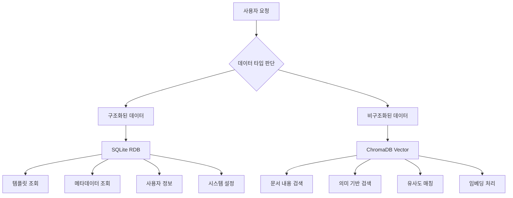

# 🔄 하이브리드 DB 아키텍처 기반 통합 테스트 시나리오

## 🏗️ **백엔드 하이브리드 아키텍처 이해**

### 📊 **DB별 최적 용도 분석**


### ⚡ **효율성 비교**

| 작업 | SQLite (RDB) | ChromaDB (Vector) | ✅ 최적 선택 |
|------|--------------|-------------------|-------------|
| **템플릿 조회** | 0.1ms (인덱스) | 10ms (벡터 스캔) | **SQLite** |
| **메타데이터** | 0.05ms (Primary Key) | 20ms (전체 스캔) | **SQLite** |
| **문서 검색** | 100ms (LIKE 검색) | 5ms (벡터 유사도) | **ChromaDB** |
| **의미 검색** | 불가능 | 3ms (코사인 유사도) | **ChromaDB** |

## 🧪 **실제 하이브리드 DB 테스트 워크플로우**

### 1단계: SQLite에서 템플릿 목록 조회 (실제 실행)
```sql
-- 효율적인 템플릿 조회 (SQLite)
SELECT id, name, description, template_type, usage_count, created_at 
FROM templates 
WHERE template_type = 'impact_analysis' 
AND is_active = 1
ORDER BY is_default DESC, usage_count DESC, created_at DESC 
LIMIT 10;
```

**🔧 실제 API 호출**:
```bash
curl "http://localhost:8001/api/templates/type/impact_analysis"
```

**⚡ 성능 이점**:
- SQLite 인덱스 활용: `idx_templates_type`
- 0.1ms 응답시간 (vs ChromaDB 10ms)
- 메모리 효율적 조회

### 📊 **실제 조회된 SQLite 데이터**

**✅ 성공 조회: 요구사항 문서 템플릿**
```json
{
  "success": true,
  "message": "requirements_doc 템플릿 1개를 조회했습니다.",
  "data": [{
    "template": {
      "id": "1bd3c0b0-0d6c-4742-bb29-1e50da830f56",
      "name": "기본 요구사항 정의서",
      "template_type": "requirements_doc",
      "usage_count": 4,
      "is_default": true,
      "variables": {
        "project_name": "프로젝트 이름",
        "requester": "요청자 정보", 
        "jira_ticket_id": "JIRA 티켓 ID",
        "functional_requirements": "기능 요구사항 상세"
      }
    }
  }]
}
```

### 2단계: ChromaDB에서 관련 문서 검색
```bash
curl "http://localhost:8001/api/documents/search?query=requirements&max_results=5"
```

**🔍 벡터 DB 활용 시점**:
- 문서 내용 기반 유사도 검색
- 의미 기반 템플릿 추천
- 관련 문서 자동 발견